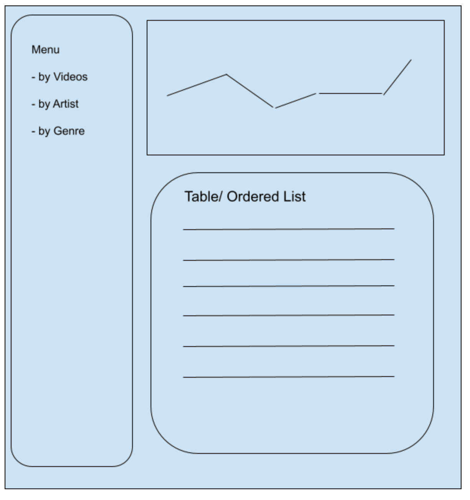
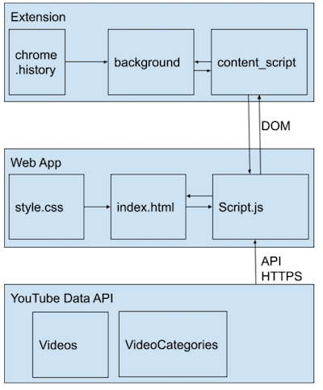

## MyStatsYT
My stats YT allow you to check your own personal YouTube video consumption stats.

The current version is a client-only (no server, just API calls) that works as a Lite version for people that don't want their stats going around third-party servers. 
 
 

### Instructions to use
1. You need to save the folder chrome_extension and report_service folders in your computer
2. Install the extension in developer mode ([instructions](https://developer.chrome.com/docs/extensions/mv3/faq/#:~:text=You%20can%20start%20by%20turning,a%20packaged%20extension%2C%20and%20more.))
3. Make sure you have a Cloud Project API key (authorized to use YouTube Data API) ([instructions to create an API Key](https://developers.google.com/youtube/registering_an_application))
4. Open index.html (from the report_service folder) in your browser and provide your API key when prompted

### Key use cases
- Know your aggregated number of access per day
- Know the videos you accessed the most
- Know which exact timestamps I had per video access
- know which channels I accessed the videos from the most

### Sketch
The intial concept is represtend in the sketch below: 
 

 
Key differences to call-out from the sketch to the final version: 
- Removed "genre" list option  
  Found out later there's no YouTube API with such information currently (Sept/2021). Might consider a possible 3rd party API in the future.
- Renamed "artist" by "channel"  
  Found out that even YouTube Music interprets the Channel name as "Artist" name. Still, the Artist names are now always consistent to the "real" Video artist given Channel names are not always reflective of the Artist name themselves. 
- Menu is retractible  
  Add more pannel space. 

### System design
The MyStatsYT Lite version rely on 3 key components: 
- Extension  
  Necessary to retrieve the Browser history on YouTube videos (and count the personal views)
- Web App  
  Aggregates and clean up data. Builds report and defines the date range if the data that needs to be pulled from the Browser history. 
- YouTube Data API  
  Enables expanding/pulling up to date Video details and additional Global stats (not personal information). 

 

### Known limitations
- Not saving history in local file  
  This means calls to Chrome extension and YouTube Data API are made every time the index.html page is laoded.
- YouTube Data API - up to 50 videos per HTTP Request  
  Calls to YouTube Data API follow the Web App report and pagination configuration. The Web App should be able to list up to 50 videos per time while it depends directly on YouTube Data API to get some of the video information (This should be improved  once local cache file is implemented)
- History is up to the last 90 days + "Today"  
  Limitation set to control quantity of data that needs to be processed. (This should be improved  once local cache file is implemented)
  Currently, this is up to the last 3 months due to limitations by Chrome Browser History. 
- Startdate parameter for history seems buggy for some day/hour   
  Report seem to not load for some day/hour combination for startdate (initial date to pull Chrome History). Observed problem when setting it for last 7 days on Sep. 5. 
- List based on Channels (or other video parameters aggregation, when made available) may have poor performance (slow loading)  
  The list by videos only do API calls per pagination (default, per 10 videos).
  Nevertheless, any other listing based on aggregated video parameters retrieved from YouTube API (e.g. Channel name, video category) will require retrieving 
  the data of the entire list of videos at once (and then have all data aggregated and ordered) which is much more computer resource consuming. 
  
  
### Additional possible features/improvements
- Separate rendering from data pull 
- Improve caching 
- Server-Client version 
- Customizable date range
- Storing collected API key
- Incorporating more stats (e.g. Global views count, Global likes) 
- Incorporating whether the user "liked" the video or not
- OAuth authentication mode
- List by other aggregated video parameters (e.g. Video Category)
- Identify Video Genre
- Rank change comparisons over time (e.g. which videos when up and which videos when down)
- Advanced addional stats: watch time

  

