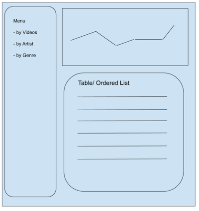

## MyStatsYT
My stats YT allow you to check your own personal YouTube video consumption stats.

The current version is a client-only (no server, just API calls) that works as a Lite version for people that don't want their stats going around third-party servers. 
 
 

### Instructions to use
1. You need to save the folder chrome_extension and report_service folders in your computer
2. Install the extension in developer mode [instructions](https://developer.chrome.com/docs/extensions/mv3/faq/#:~:text=You%20can%20start%20by%20turning,a%20packaged%20extension%2C%20and%20more.)
3. Edit the script.js (from the report_service folder) and include a Cloud Project API key (authorized to use YouTube Data API)
4. Open index.html (from the report_service folder) in your browser

### Sketch
The intial concept is represtend in the sketch below: 
 

 
Key differences to call-out from the sketch to the final version: 
- Removed "genre" list option  
  Found out later there's no YouTube API with such information currently (Sept/2021). Might consider a possible 3rd party API in the future.
- Renamed "artist" by "channel"  
  Found out that even YouTube Music interprets the Channel name as "Artist" name. Still, the Artist names are now always consistent to the "real" Video artist given Channel names are not always reflective of the Artist name themselves. 
- Menu is retractible  
  Add more pannel space. 

### System design
The MyStatsYT Lite version rely on 3 key components: 
- Extension  
  Necessary to retrieve the Browser history on YouTube videos (and count the personal views)
- Web App  
  Aggregates and clean up data. Builds report and defines the date range if the data that needs to be pulled from the Browser history. 
- YouTube Data API  
  Enables expanding/pulling up to date Video details and additional Global stats (not personal information). 

 

